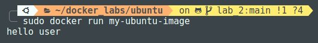

<!-- ## lab_1

### Create a container from hello-world image and set its name to first-container.

```bash
 docker run --name  first-container hello-world
```

```bash
docker run --name  first-container hello-world                           
Unable to find image 'hello-world:latest' locally
latest: Pulling from library/hello-world
c1ec31eb5944: Pull complete 
Digest: sha256:a26bff933ddc26d5cdf7faa98b4ae1e3ec20c4985e6f87ac0973052224d24302
Status: Downloaded newer image for hello-world:latest

Hello from Docker!
This message shows that your installation appears to be working correctly.

To generate this message, Docker took the following steps:
 1. The Docker client contacted the Docker daemon.
 2. The Docker daemon pulled the "hello-world" image from the Docker Hub.
    (amd64)
 3. The Docker daemon created a new container from that image which runs the
    executable that produces the output you are currently reading.
 4. The Docker daemon streamed that output to the Docker client, which sent it
    to your terminal.

To try something more ambitious, you can run an Ubuntu container with:
 $ docker run -it ubuntu bash

Share images, automate workflows, and more with a free Docker ID:
 https://hub.docker.com/

For more examples and ideas, visit:
 https://docs.docker.com/get-started/
```


### Create two containers from nginx image, run the first one in the foreground and the second one in the background.
 	
   ```bash
    docker run nginx  
   ```


```bash
    docker run -d nginx  
   ```


### Download bitnami/laravel image (version 9.5.2) List all images Remove laravel image 
 
 ```bash
 docker pull bitnami/laravel:9.5.2  
 ```
 

  ```bash
 docker images  
 ```
  

 ```bash
   docker rmi bitnami/laravel:9.5.2
   ```
  


### Create a container from httpd image  Map apache server running on the container to port 82 on your local machine Check that it is working using your browser

```bash
docker run -p 82:80 httpd
```
  
   

 
### Create file inside foreground container then list all files (use interactive mode) Remove this container 

```bash
docker run httpd
```
   

### Print /etc/hosts file from background container (without interactive mode)

   

### Create mysql container, map tmp directory (on your local machine) to /var/lib (on the container).<br/>Create a volume lab1, start two containers from nginx image and mount this volume to /app, create a file from the first container on the path mapped to this volume and check that it exists on the second container. 

   
       -->

# Lab 2
 
####  Create an image to containerize a simple php app that prints hello world, use apache server

```dockerfile
FROM php:7.4-apache
COPY . /var/www/html
WORKDIR /var/www/html
```
```php
<?php
echo "hello, I am Mo 😉"
?>
```
```bash
sudo docker build -t my-php-app .  
```
```bash
sudo docker run -p 83:80 my-php-app
```


#### Push this image to docker hub 

```bash
sudo docker push devmayman/dockerhub/my-php-app    
```


#### Remove it from your local machine


#### Use the image you uploaded to create a container that works on port 80


#### Write a Dockerfile, use ubuntu as the base image and use CMD to echo hello user.

```dockerfile
FROM ubuntu

WORKDIR /app

CMD ["echo", "hello user"]
```

#### Create two containers from this image, create the first one without passing a parameter and use ls command as the parameter when creating the second one


```bash
docker run my-ubuntu-image
```



```bash
docker run my-ubuntu-image ls lsa
```


#### Do the same as the last question but use ENTRYPOINT.

```bash
docker run my-ubuntu-image
```


```bash
docker run my-ubuntu-image ls lsa
```


### Use both cmd and entrypoint to echo hello + the parameter passed

```bash
docker run my-ubuntu-image
```


```bash
docker run my-ubuntu-image mo
```


 
#### Host a react application on nginx. (Use multi-stage dockerfile).

```dockerfile
#React app image
FROM node:lts-alpine as build

WORKDIR /app

COPY package*.json ./

RUN npm ci

COPY . .

RUN npm run build


FROM nginx:latest as prod#React app image
FROM node:lts-alpine as build

WORKDIR /app

COPY package*.json ./

RUN npm ci

COPY . .

RUN npm run build


FROM nginx:latest as prod

COPY --from=build /app/build /usr/share/nginx/html
COPY nginx.conf /etc/nginx/nginx.conf

EXPOSE 80/tcp

CMD ["/usr/sbin/nginx", "-g", "daemon off;"]


COPY --from=build /app/build /usr/share/nginx/html
COPY nginx.conf /etc/nginx/nginx.conf

EXPOSE 80/tcp

CMD ["/usr/sbin/nginx", "-g", "daemon off;"]

```

